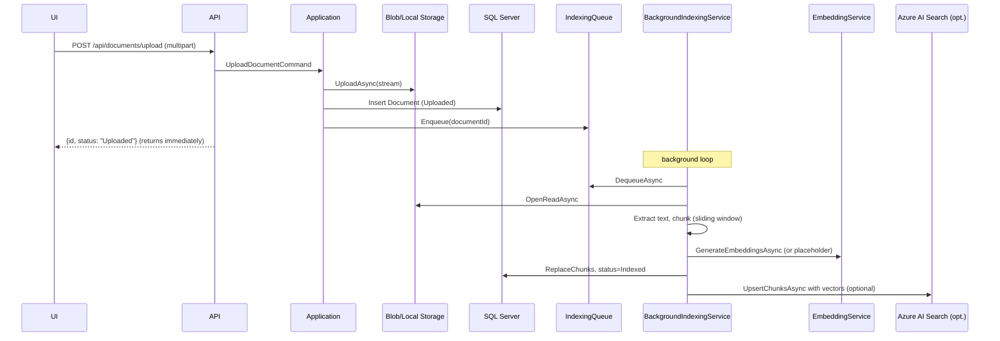
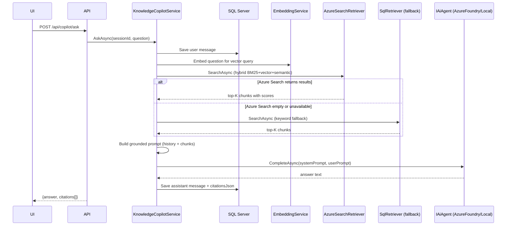
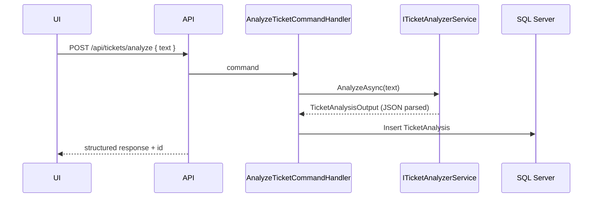
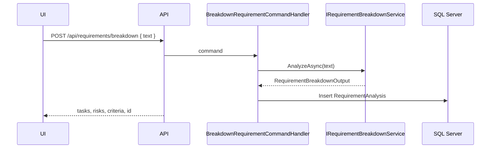

# Architecture

DevAssist AI Workspace is a **modular monolith**: one deployable API with clear module boundaries, shared persistence, and swappable Azure integrations.

---

## Layered backend structure

```
DevAssist.Api
    └── Controllers (HTTP)
            └── MediatR (Commands / Queries)
                    └── Application handlers
                            └── Domain entities
                            └── Infrastructure services (via interfaces)
```

| Project | Responsibility |
|---------|----------------|
| `DevAssist.Domain` | Entities (`Document`, `DocumentChunk`, `ChatSession`, `ChatMessage`, `TicketAnalysis`, `RequirementAnalysis`) and enums |
| `DevAssist.Application` | Use cases: commands, queries, validators, mappers, service interfaces |
| `DevAssist.Infrastructure` | EF Core `DevAssistDbContext`, repositories, Azure adapters, prompt builders, AI agents |
| `DevAssist.Contracts` | API DTOs (`ApiResponse<T>`, module request/response records) |
| `DevAssist.Api` | Composition root, CORS, Serilog, Swagger, health checks, auto-migrate (Development) |

**Cross-cutting:** FluentValidation on commands, Serilog request logging, `ApiResponse<T>` envelope for module endpoints, global `ApiExceptionHandler` for consistent error JSON.

---

## Module boundaries

### Documents
- Upload files to Blob Storage or local filesystem
- Track metadata and status (`Uploaded` → `Processing` → `Indexed` / `Failed`)
- Extract text (`.txt`, `.md`), chunk (sliding window, 1000 chars / 200 overlap)
- Generate embedding vectors (Azure OpenAI) and upsert to Azure AI Search
- Background indexing via `BackgroundDocumentIndexingService` — upload returns immediately

**Key types:** `IDocumentRepository`, `IDocumentStorageService`, `IDocumentIndexingOrchestrator`, `IDocumentSearchIndexer`, `IDocumentIndexingQueue`

### Knowledge Copilot
- Chat sessions and messages persisted in SQL
- Retrieve relevant chunks with hybrid/vector search (Azure AI Search) or SQL keyword fallback
- Build grounded prompt with context window and chat history
- `IAiAgent` (AzureFoundryAgent or LocalFallbackAgent) generates the answer
- Return answer with citation DTOs (document name + chunk reference)

**Key types:** `IChatRepository`, `IDocumentSearchRetriever`, `ICopilotPromptBuilder`, `IKnowledgeCopilotService`, `IAiAgent`

### Ticket Analyzer
- Analyze free-text ticket → structured JSON via Azure OpenAI
- Map severity string to `TicketSeverity` enum
- Persist `TicketAnalysis`

**Key types:** `ITicketAnalyzerService`, `ITicketAnalysisRepository`, `ITicketAnalyzerPromptBuilder`

### Requirement Breakdown
- Analyze requirement text → structured implementation plan JSON
- Persist `RequirementAnalysis` (task lists as JSON columns)
- List and get-by-id for history reload

**Key types:** `IRequirementBreakdownService`, `IRequirementAnalysisRepository`, `IRequirementBreakdownPromptBuilder`

---

## Request flows (Phase 2)

### Document upload — background indexing



### Copilot question answering (Phase 2 — hybrid + vector)



### Ticket analysis



### Requirement breakdown



---

## Infrastructure responsibilities (Phase 2)

| Component | Azure (when configured) | Fallback (local) |
|-----------|------------------------|-----------------|
| AI agent | `AzureFoundryAgent` (Azure AI Foundry / OpenAI) | `LocalFallbackAgent` → heuristics |
| Chat service | `AzureFoundryAgent` (via `IAzureOpenAiChatService`) | `LocalGroundedChatService` |
| Embeddings | `AzureOpenAiEmbeddingService` | `PlaceholderEmbeddingService` (empty vectors) |
| Document storage | `AzureBlobDocumentStorageService` | `LocalFileDocumentStorageService` |
| Search indexing | `AzureSearchDocumentIndexer` (with vectors + semantic) | `NoOpDocumentSearchIndexer` |
| Chunk retrieval | `HybridDocumentSearchRetriever` (Azure first → SQL fallback) | `SqlDocumentSearchRetriever` |
| Ticket analysis | `AzureOpenAiTicketAnalyzerService` | `LocalTicketAnalyzerService` |
| Requirement breakdown | `AzureOpenAiRequirementBreakdownService` | `LocalRequirementBreakdownService` |

Registration is centralized in `InfrastructureServiceCollectionExtensions.cs` — each Azure service is selected based on configuration presence at startup.

---

## IAiAgent abstraction (Phase 2)

`IAiAgent` is the Phase 2 high-level AI completion abstraction defined in the Application layer. It replaces direct use of `IAzureOpenAiChatService` in new code and exposes an `IsConfigured` property so callers can adapt behavior.

```
IAiAgent
├── AzureFoundryAgent  — Azure AI Foundry / Azure OpenAI (also IAzureOpenAiChatService)
└── LocalFallbackAgent — returns empty string; callers apply module-specific logic
```

`IAzureOpenAiChatService` is preserved for backward compatibility. Existing module services (`KnowledgeCopilotService`, `AzureOpenAiTicketAnalyzerService`, `AzureOpenAiRequirementBreakdownService`) continue to receive `IAzureOpenAiChatService` through DI, which is now fulfilled by `AzureFoundryAgent` when Azure is configured.

---

## Background indexing architecture

```
HTTP Thread                        Background Thread
──────────────────────             ──────────────────────────────────────────
UploadDocumentCommand              BackgroundDocumentIndexingService (Hosted)
  → save file                        loop:
  → insert Document (SQL)              documentId = queue.DequeueAsync()
  → queue.Enqueue(id)  ──────────►     scope = CreateScope()
  ← return 200 immediately             orchestrator.IndexAsync(documentId)
                                         extract → chunk → embed → index
                                       log result
```

The `DocumentIndexingQueue` is an unbounded `System.Threading.Channels.Channel<Guid>` singleton.
Items survive server restarts only if re-indexed via `POST /api/documents/{id}/index`.

---

## Azure service responsibilities

### Azure AI Foundry / Azure OpenAI
- **Chat deployment:** copilot answers, ticket JSON, requirement JSON
- **Embedding deployment:** dense vector generation for hybrid/semantic chunk retrieval
- Supports both standard Azure OpenAI and Foundry serverless `/v1` endpoints

### Azure AI Search
- Stores document chunk index with vector field (`contentVector`, HNSW cosine)
- Supports BM25 keyword, KNN vector, hybrid (RRF), and semantic re-ranking
- Index created automatically on first upsert

### Azure Blob Storage
- Durable document file storage for uploads
- Local `./data/documents` mirrors this in development

### SQL Server
- System of record: documents, chunks, chat sessions/messages, analyses
- Keyword fallback retriever uses `LIKE`-based BM25 scoring from SQL chunks

---

## Frontend architecture

```
frontend/devassist-ui/src/
├── api/           # Typed fetch clients + parseApiResponse
├── app/           # routes, queryKeys, global styles
├── components/    # documents/, copilot/, ui/
├── layout/        # AppLayout shell
├── pages/         # Dashboard, Copilot, Tickets, Requirements
└── types/         # TypeScript DTO mirrors
```

- **TanStack Query** for server state, caching, and invalidation after mutations
- **Vite dev proxy** forwards `/api` and `/health` to `localhost:5147`
- Module pages use consistent panels, loading/error states, and history sidebars

---

## Key extension points

| Extension | How |
|-----------|-----|
| New AI module | Add interface in Application, prompt builder + service in Infrastructure, MediatR handler, controller, frontend page |
| New document type / extractor | Implement `IDocumentTextExtractor`, register in DI |
| Swap retrieval strategy | Implement `IDocumentSearchRetriever`, register based on config |
| Auth / RBAC | Add middleware + user context; filter repositories by tenant/user |
| Work item export | New Application command calling Azure DevOps client from analyzer output |
| Streaming responses | Replace `CompleteAsync` with `StreamAsync` in `IAiAgent`; update controllers to SSE |

---

## Persistence model

| Table | Purpose |
|-------|---------|
| `Documents` | File metadata, status, blob path |
| `DocumentChunks` | Indexed text segments linked to documents |
| `ChatSessions` / `ChatMessages` | Copilot conversation state with citation JSON |
| `TicketAnalyses` | Persisted ticket triage results |
| `RequirementAnalyses` | Persisted breakdown results (JSON task columns) |

EF Core migrations live in `DevAssist.Infrastructure/Migrations/`.
