# DevAssist AI Workspace — User Guide (Screenshots)

Visual walkthrough of the application, captured **August 31, 2026**. Screenshots are stored in [`docs/screenshots/`](./screenshots/) with numbered filenames for reading order.

---

## 1. Sign in

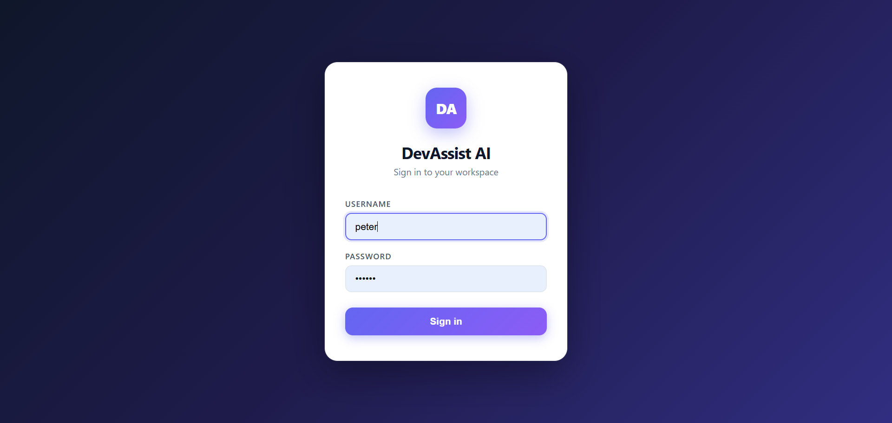

Local authentication — sign in with your workspace username and password. Default admin (first run): `admin` / `Admin@123!`.

---

## 2. Dashboard

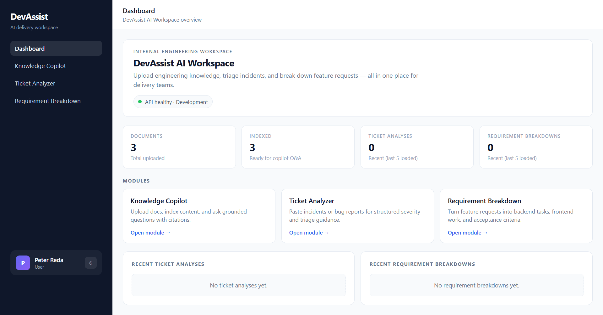

Workspace overview: document counts, indexed documents, recent analyses, and quick links to all modules. API health is shown in the hero banner.

---

## 3. Knowledge Copilot

### 3.1 Chat workspace (empty state)

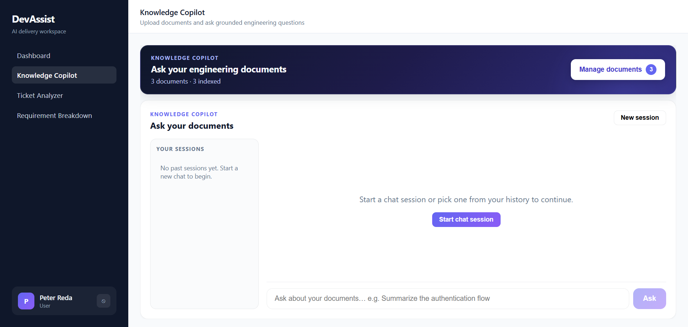

Upload and index documents first, then start a chat session or type a question in the input at the bottom. Use **Manage documents** to open the document library.

### 3.2 Document library

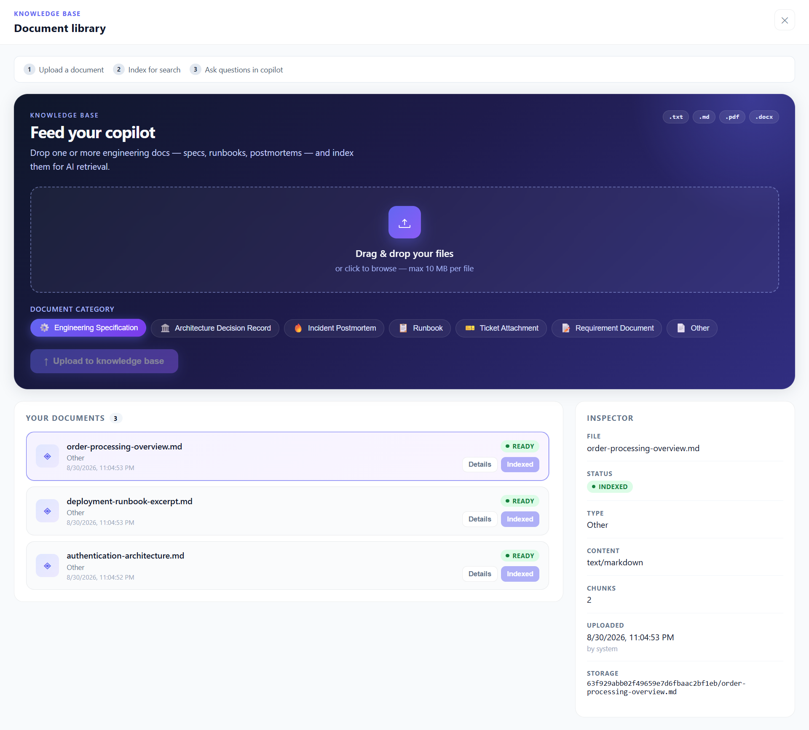

Full-screen drawer workflow:

1. **Upload** — drag & drop `.txt`, `.md`, `.pdf`, `.docx` (multi-file supported)
2. **Index** — click **Index** on each document card
3. **Ask** — return to chat and ask grounded questions

The **Inspector** panel shows metadata, chunk count, and indexing status for the selected file.

### 3.3 Grounded Q&A (English)

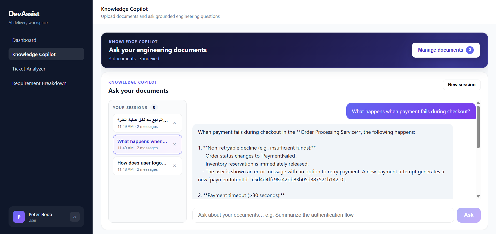

Ask questions about indexed documents. Answers include **source citations**. Session titles are derived from the **first question** (ChatGPT-style). Past sessions appear in the left panel; the active session is highlighted.

---

## 4. Ticket & Incident Analyzer

### 4.1 Empty state

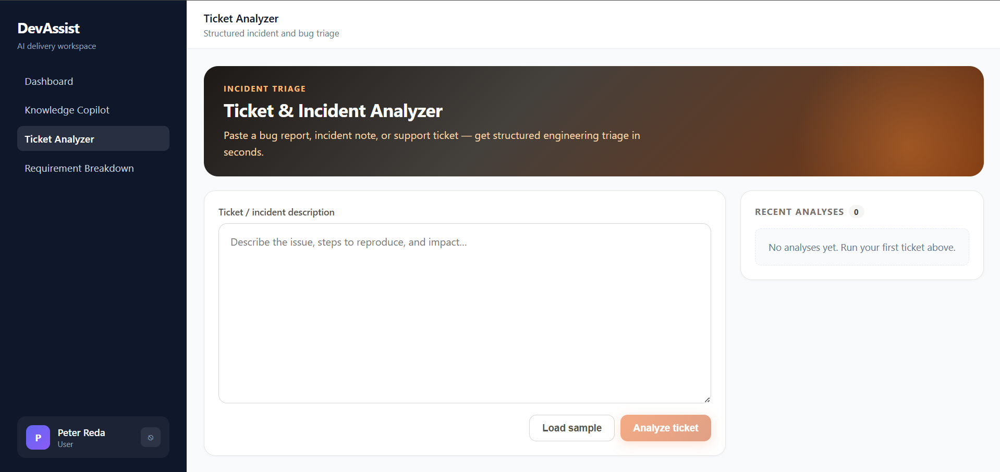

Paste a bug report or incident note, or use **Load sample** to try a demo ticket.

### 4.2 Analysis result

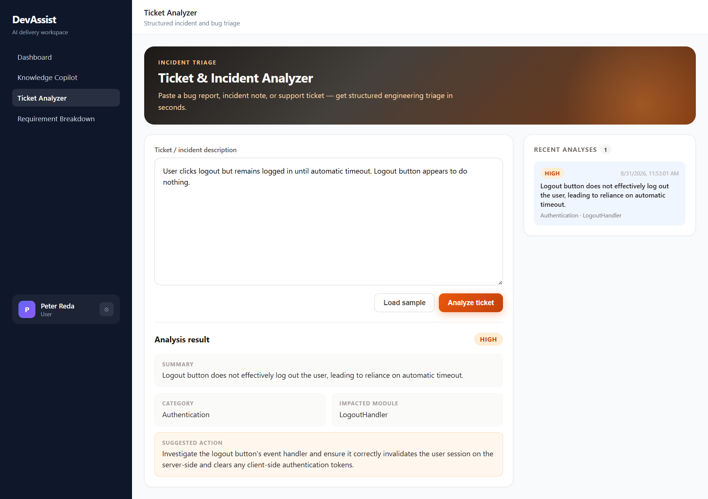

Structured triage output: **severity**, **category**, **impacted module**, and **suggested action**. Recent analyses are listed on the right.

---

## 5. Requirement Breakdown

### 5.1 Empty state

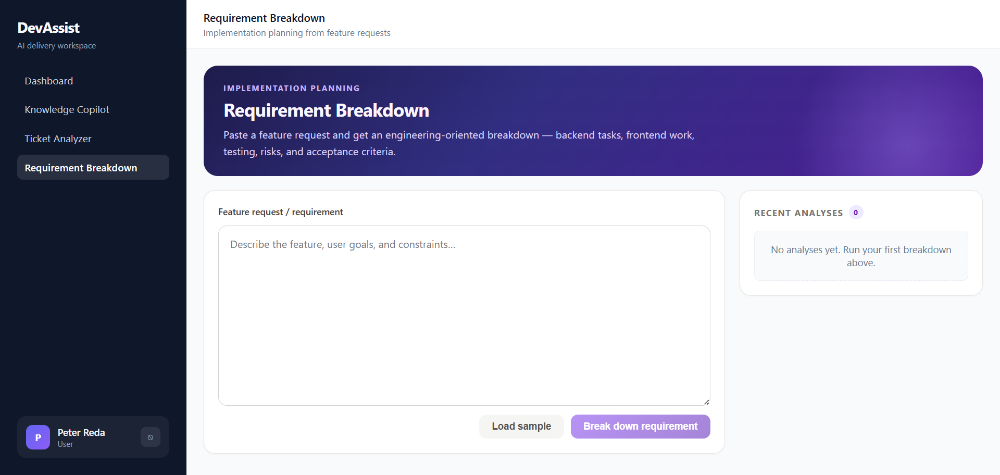

Paste a feature request or use **Load sample** to generate an engineering breakdown.

### 5.2 Breakdown result

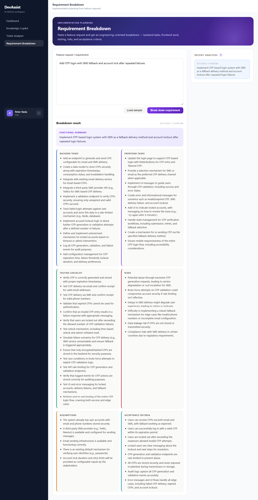

Full implementation plan: functional summary, backend/frontend tasks, testing checklist, risks, assumptions, and acceptance criteria.

---

## 6. Admin — User Management

> Visible to **Admin** role only.

### 6.1 User list

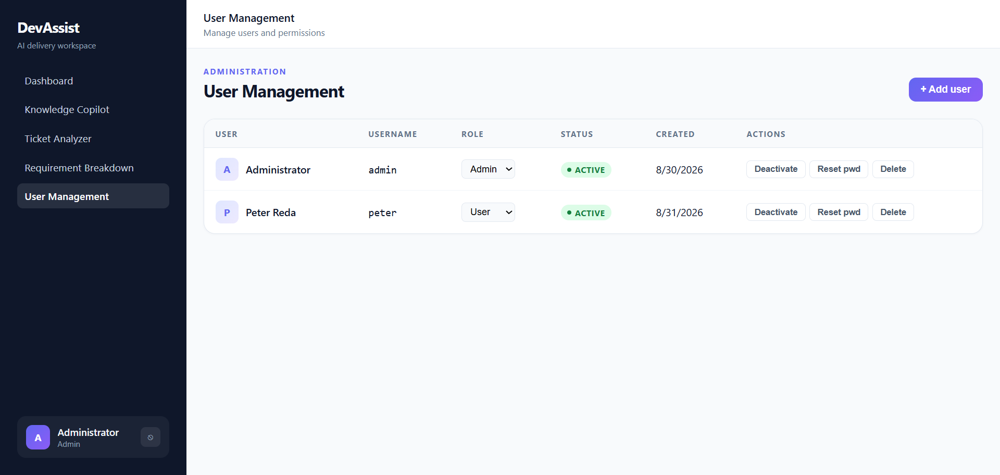

Manage users: change role, activate/deactivate, reset password, or delete.

### 6.2 Add user form

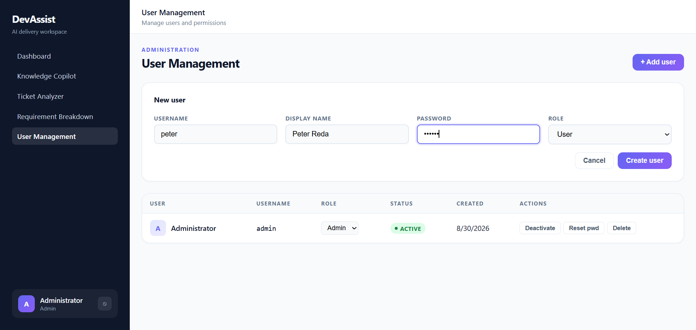

Create a new workspace user with username, display name, password, and role.

---

## Screenshot index

| # | File | Module |
|---|------|--------|
| 01 | `01-login.png` | Authentication |
| 02 | `02-dashboard.png` | Dashboard |
| 03 | `03-knowledge-copilot-empty.png` | Knowledge Copilot |
| 04 | `04-knowledge-copilot-document-library.png` | Knowledge Copilot — documents |
| 05 | `05-knowledge-copilot-english-answer.png` | Knowledge Copilot — Q&A |
| 06 | `06-ticket-analyzer-empty.png` | Ticket Analyzer |
| 07 | `07-ticket-analyzer-result.png` | Ticket Analyzer |
| 08 | `08-requirement-breakdown-empty.png` | Requirement Breakdown |
| 09 | `09-requirement-breakdown-result.png` | Requirement Breakdown |
| 10 | `10-admin-users-list.png` | Admin |
| 11 | `11-admin-users-add-form.png` | Admin |
